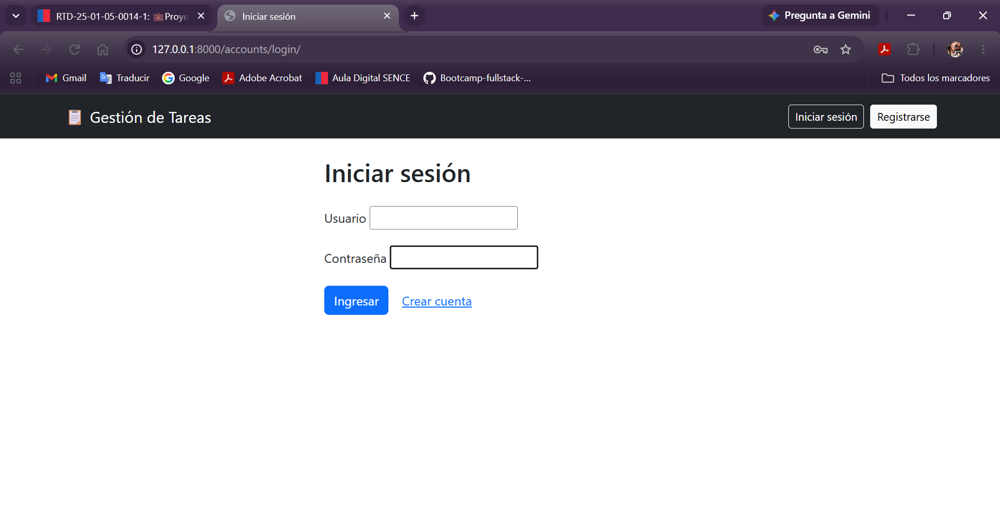
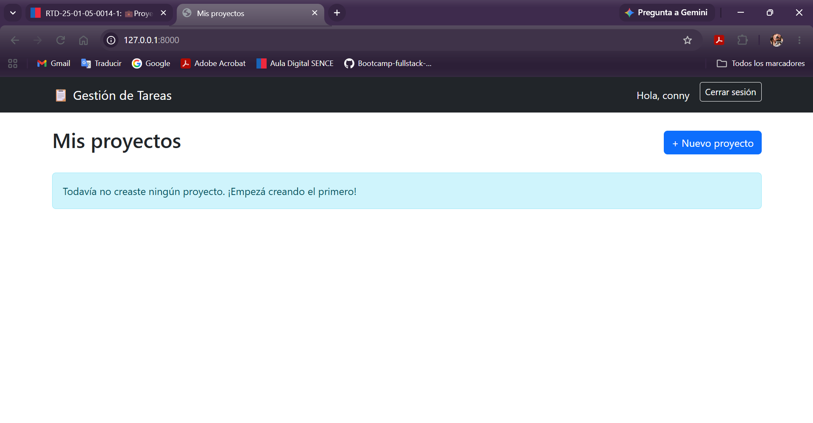
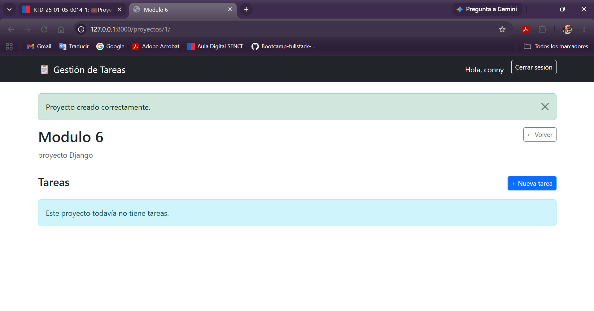
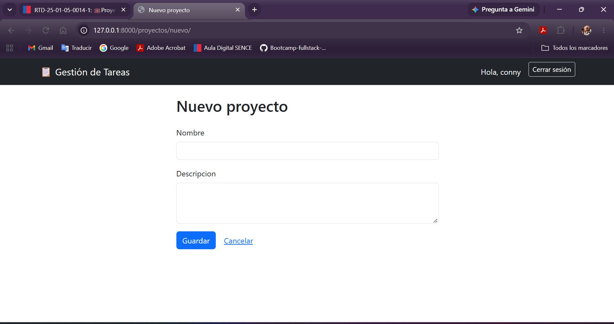
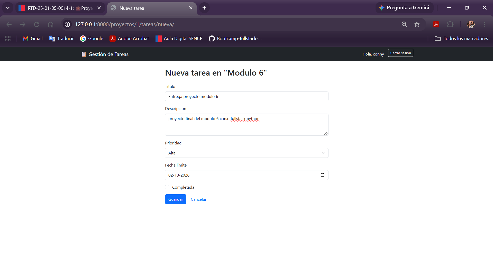
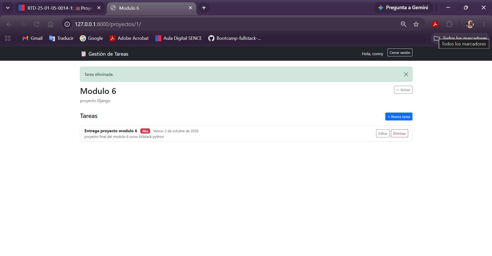
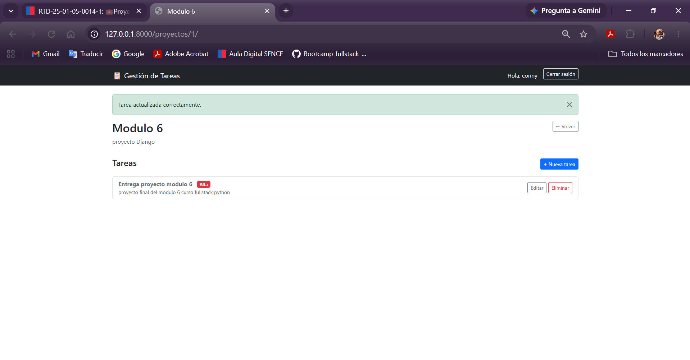
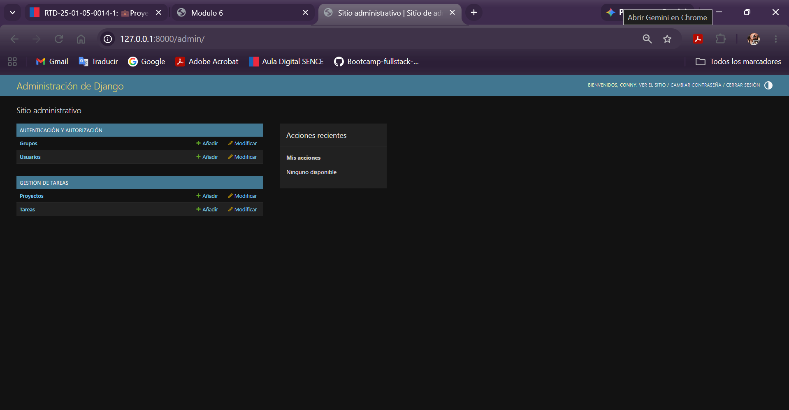
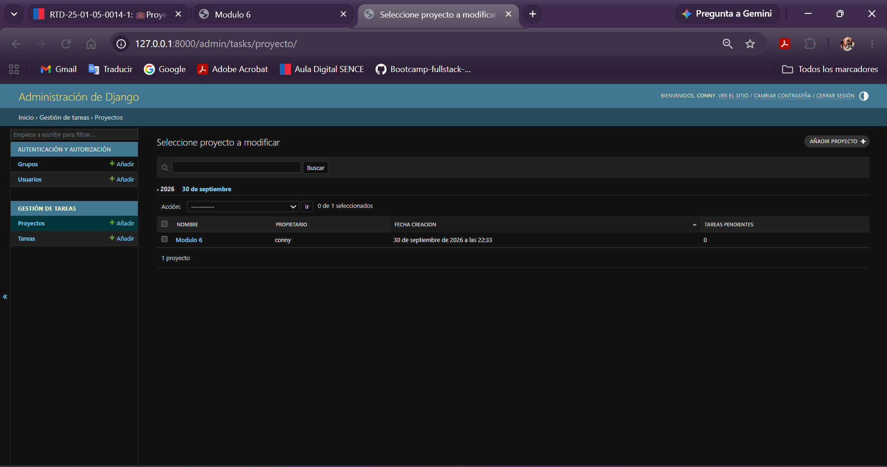
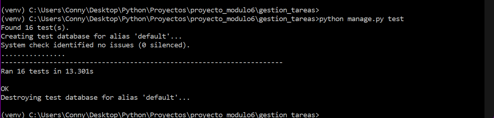

# Gestión de Tareas — Django Web App

Proyecto de evaluación del módulo 6 (Alkemy). Aplicación web en Django que permite
a los usuarios registrarse, autenticarse, gestionar **proyectos** y **tareas**, y
visualizar sus datos de forma dinámica.

## Funcionalidades

- Registro y autenticación de usuarios con `django.contrib.auth`.
- Cada usuario ve y gestiona únicamente sus propios proyectos y tareas.
- CRUD completo de **Proyectos** y **Tareas** (crear, ver, editar, eliminar).
- Templates con herencia (`base.html`) y Bootstrap 5.
- Formularios con validaciones personalizadas (`forms.ModelForm`).
- Protección CSRF en todos los formularios.
- Restricción de acceso con `LoginRequiredMixin` y `UserPassesTestMixin`.
- Sitio de administración personalizado (`admin.py`) con inlines y filtros.
- Pruebas unitarias de modelos, permisos y vistas (`tasks/tests.py`).

## Estructura del proyecto

```
gestion_tareas/
├── config/                 # Configuración del proyecto (settings, urls)
├── tasks/                  # App principal
│   ├── models.py           # Modelos Proyecto y Tarea
│   ├── forms.py            # RegistroForm, ProyectoForm, TareaForm
│   ├── views.py             # Vistas basadas en clases (CBV)
│   ├── urls.py
│   ├── admin.py
│   ├── tests.py
│   ├── migrations/
│   └── templates/tasks/
├── templates/
│   ├── base.html
│   └── registration/       # login.html, signup.html
├── static/css/
├── manage.py
└── requirements.txt
```

## Instalación

1. Clonar el repositorio y entrá a la carpeta del proyecto:
   ```bash
   cd gestion_tareas
   ```

2. Crear y activar un entorno virtual:
   ```bash
   python -m venv venv
   source venv/bin/activate   # En Windows: venv\Scripts\activate
   ```

3. Instalar las dependencias:
   ```bash
   pip install -r requirements.txt
   ```

4. Aplicar las migraciones:
   ```bash
   python manage.py migrate
   ```

5. Crear un superusuario (para acceder al panel de administración):
   ```bash
   python manage.py createsuperuser
   ```

6. Levantar el servidor de desarrollo:
   ```bash
   python manage.py runserver
   ```

7. Abrir el navegador en `http://127.0.0.1:8000/`.

## Uso

- **`/`** — Lista de proyectos del usuario autenticado.
- **`/accounts/login/`** — Iniciar sesión.
- **`/registro/`** — Crear una cuenta nueva.
- **`/proyectos/nuevo/`** — Crear un proyecto.
- **`/proyectos/<id>/`** — Ver detalle de un proyecto y sus tareas.
- **`/proyectos/<id>/tareas/nueva/`** — Agregar una tarea a un proyecto.
- **`/admin/`** — Panel de administración (requiere superusuario).

## Ejecutar las pruebas

```bash
python manage.py test
```

Las pruebas cubren:
- Modelos (`Proyecto`, `Tarea`): valores por defecto y representación en texto.
- Seguridad: que las vistas requieran login y que un usuario no pueda ver ni
  editar proyectos/tareas de otro usuario.
- CRUD: creación, edición y eliminación de proyectos y tareas, incluyendo
  validaciones de formulario.

## Notas técnicas

- Base de datos: SQLite (`db.sqlite3`), suficiente para la entrega y pruebas
  del proyecto.
- La `SECRET_KEY` en `settings.py` es solo para desarrollo/evaluación; en un
  entorno real debería moverse a una variable de entorno.
- Relación de datos: `Usuario → Proyecto → Tarea` (un usuario tiene varios
  proyectos, cada proyecto tiene varias tareas).

## Capturas de pantalla

### Inicio de sesión


### Lista de proyectos (sin proyectos todavía)


### Proyecto creado


### Nuevo proyecto


### Creando una tarea


### Tarea creada


### Tarea marcada como completada


### Login como superusuario (admin)


### Panel de administración - Proyectos


### Pruebas unitarias ejecutadas

