# Alke Wallet 💜

Billetera digital para **Alke Financial**, construida con Django (Módulo 7). Permite gestionar clientes, cuentas y transferencias, con reportes y panel de administración.

## Arquitectura

```
alke_wallet/     configuración del proyecto (settings, urls)
gestion/         app principal: models, forms, views (CBV), urls, admin, tests
templates/       base.html, registration/login.html, gestion/*.html
static/css/      alke.css (tema morado / violeta / lila)
```

**Modelos y relaciones**

| Modelo | Relación |
|---|---|
| `Cliente` | Uno a Uno con `User` (opcional) |
| `Cuenta` | Muchos a Uno con `Cliente` y `Moneda`; Muchos a Muchos con `Cliente` (`co_titulares`) |
| `Transaccion` | Muchos a Uno con `Cuenta` (origen y destino); mueve los saldos de forma atómica |

**Apps preinstaladas:** `admin` (panel en `/admin/`), `auth` (login/logout en `/accounts/`), `staticfiles` (CSS en `static/`). Todas las vistas exigen sesión (`LoginRequiredMixin`) y los formularios llevan ``.

**Consultas personalizadas** (`/reportes/`): `filter()` + `exclude()` + `annotate()`, `raw()` parametrizado y `connection.cursor()`.

## Ejecutar en local

```bash
python -m venv venv
source venv/bin/activate        # Windows: venv\Scripts\activate
pip install -r requirements.txt
python manage.py makemigrations gestion
python manage.py migrate
python manage.py createsuperuser
python manage.py runserver
```

1. Entra a `http://127.0.0.1:8000/admin/` y crea al menos una **Moneda** (ej. CLP, símbolo `$`).
2. Entra a `http://127.0.0.1:8000/` e inicia sesión para crear clientes, cuentas y transferencias.

## PostgreSQL (producción)

```bash
pip install psycopg2-binary
export USE_POSTGRES=1 DB_NAME=alke_wallet DB_USER=postgres DB_PASSWORD=... DB_HOST=localhost DB_PORT=5432
python manage.py migrate
```

## Pruebas

```bash
python manage.py test
```

Cubren: generación de número de cuenta, transferencias y saldos, saldo insuficiente, reversión, unicidad de correo, login obligatorio, CRUD de clientes y carga de reportes.

## Git

```bash
git init
git add . && git commit -m "feat: proyecto base Alke Wallet"
git branch -M main
git checkout -b feature/modelos
git checkout -b feature/crud
```

## Capturas

### 1. Configuración de la base de datos
En `settings.py` se usa SQLite en desarrollo y PostgreSQL en producción, activado con la variable `USE_POSTGRES`.

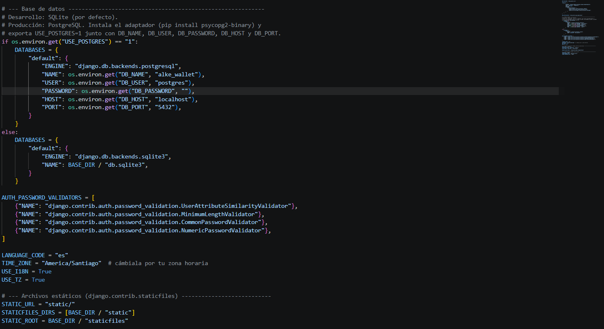

### 2. Modelos y relaciones
Los modelos `Moneda`, `Cliente`, `Cuenta` y `Transaccion` usan relaciones Uno a Uno, Muchos a Uno y Muchos a Muchos.

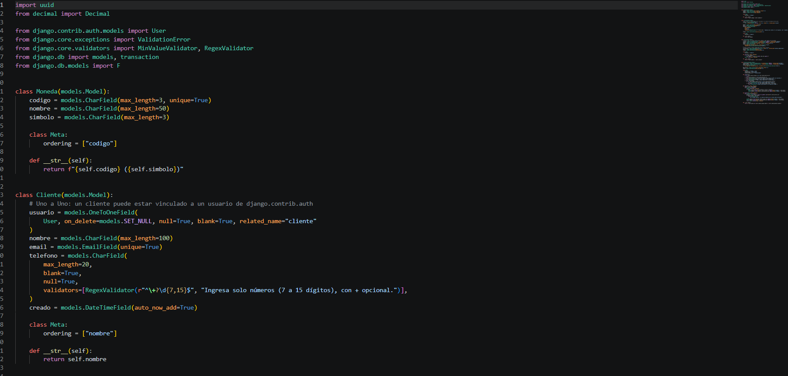
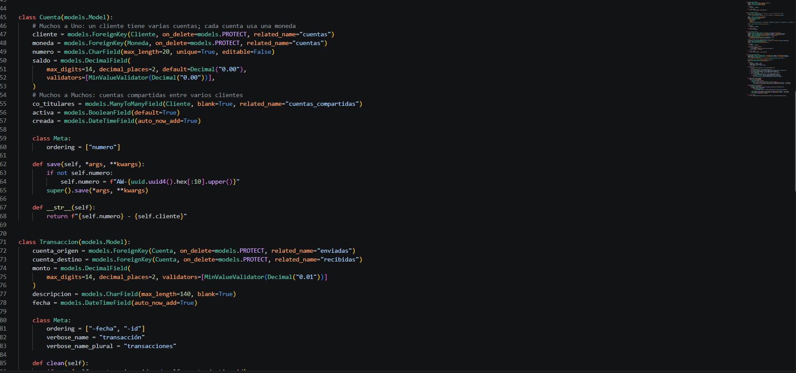

### 3. Migraciones y servidor
Se generaron las migraciones con `makemigrations`, se aplicaron con `migrate` y se levantó el servidor de desarrollo.

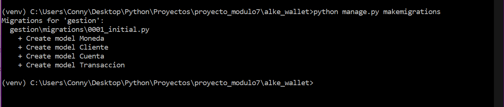
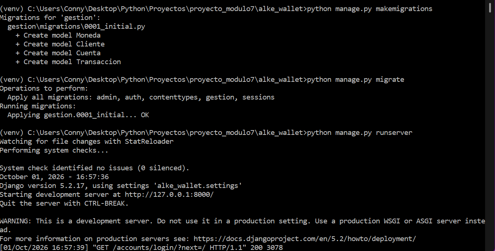

### 4. CRUD desde la shell de Django
Se creó, leyó, actualizó y eliminó un registro de `Cliente` con el ORM.

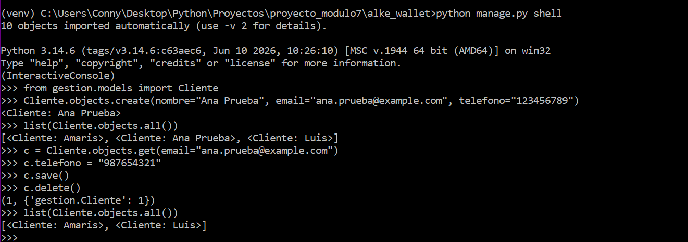

### 5. Consultas personalizadas
Se usaron `filter()`, `exclude()` y `annotate()`, y también SQL directo con `raw()` y con un cursor.

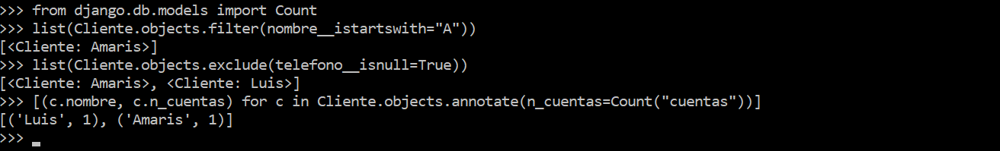
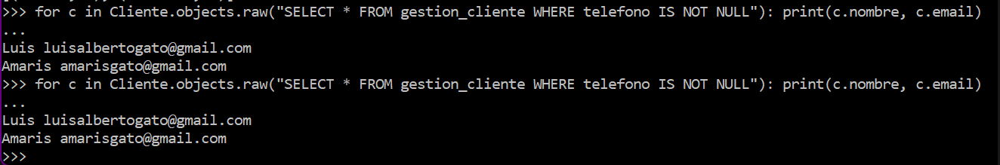
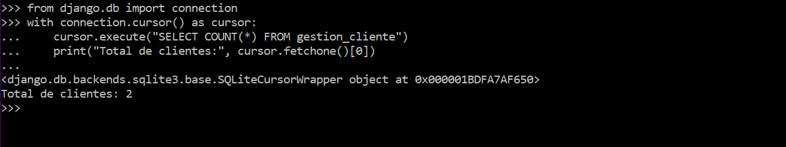

### 6. Administración y autenticación
El modelo se gestiona desde `/admin/`. Al entrar a `/clientes/` sin sesión, Django redirige al login.

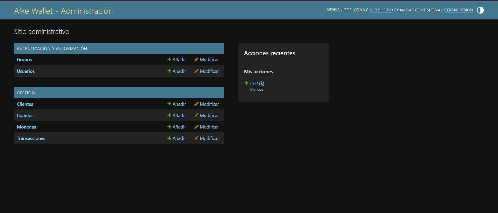


### 7. CRUD de clientes en la web
Los formularios están protegidos con token CSRF y las rutas usan el identificador del registro.

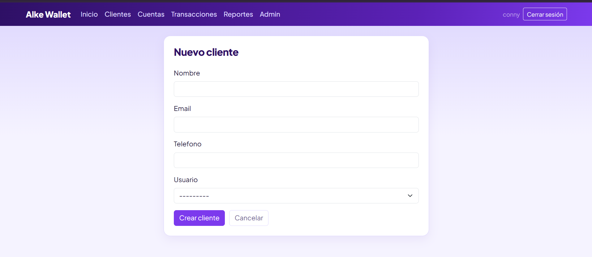
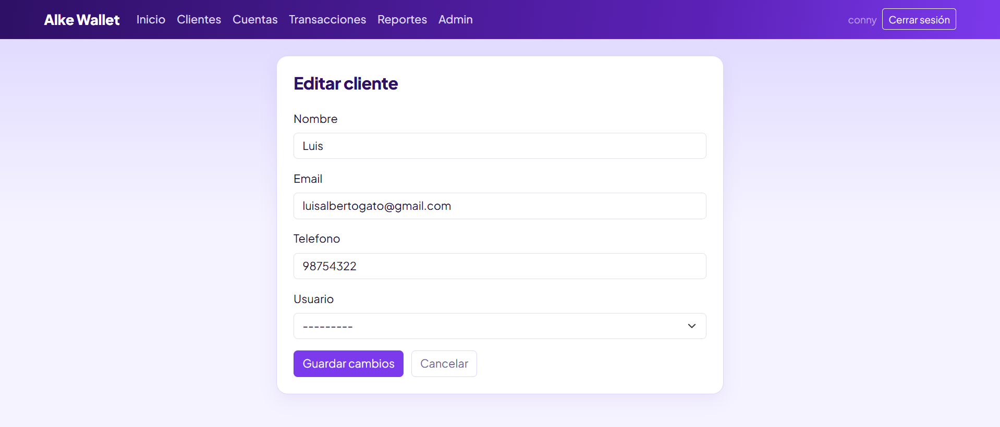
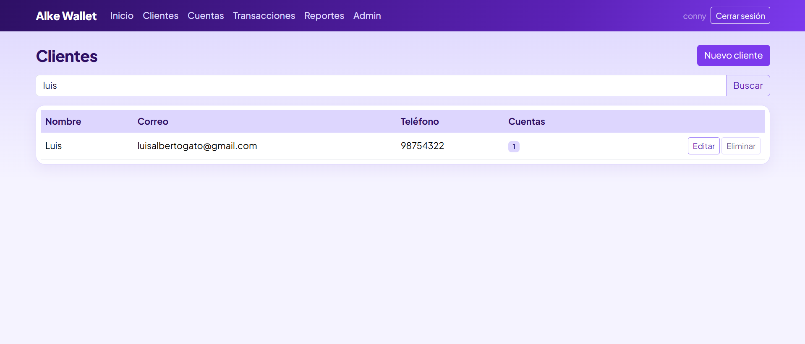
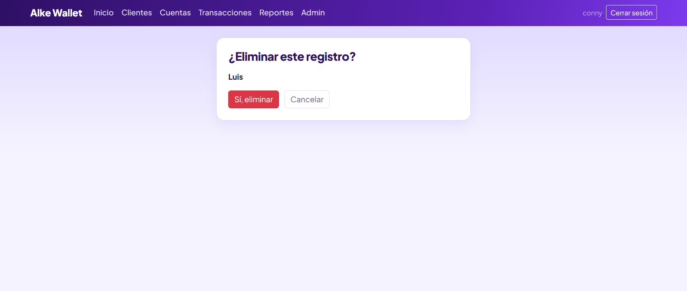

### 8. Transferencias y validaciones
Las transferencias actualizan los saldos, validan el saldo disponible y se pueden revertir.

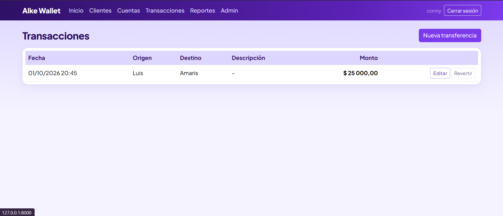
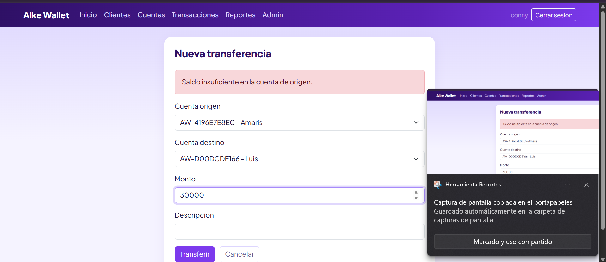
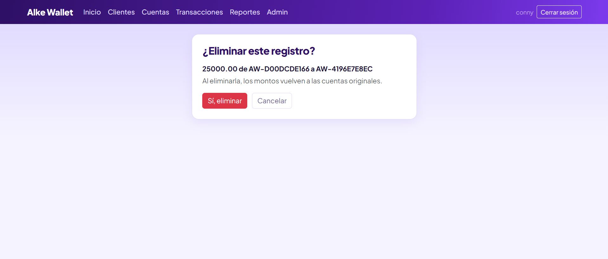

### 9. Integridad de los datos
Una cuenta con movimientos no se puede eliminar: se muestra un aviso en lugar de un error.

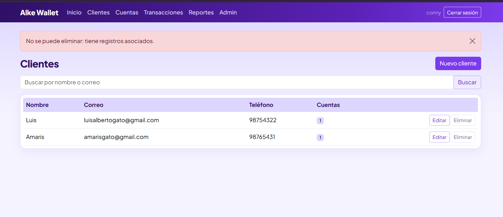

### 10. Reportes
La página de reportes usa consultas ORM y SQL personalizado.

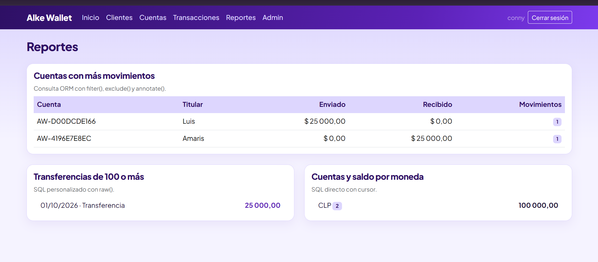

### 11. Pruebas
Se ejecutaron 10 pruebas unitarias y de integración con `python manage.py test`, todas exitosas.

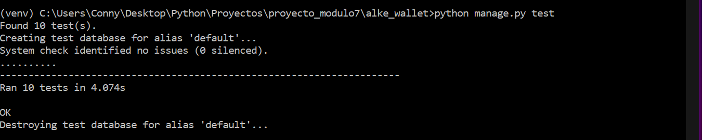

## Resumen del proceso

1. Se configuró el proyecto Django con entorno virtual, SQLite para desarrollo y PostgreSQL para producción.
2. Se creó la app `gestion` y se definieron los modelos `Moneda`, `Cliente`, `Cuenta` y `Transaccion` con sus relaciones.
3. Se generaron y aplicaron las migraciones y se verificó la estructura de tablas.
4. Se probaron operaciones CRUD y consultas personalizadas (`filter`, `exclude`, `annotate`, `raw` y cursor) desde la shell.
5. Se implementaron vistas basadas en clases con formularios protegidos con CSRF, rutas dinámicas y plantillas.
6. Se integraron las aplicaciones preinstaladas: `admin`, `auth` (login y logout) y `staticfiles`.
7. Se escribieron pruebas automatizadas y se documentó el proyecto.
8. Se versionó el código con Git y GitHub usando las ramas `main`, `feature/modelos` y `feature/crud`.

## Informe de pruebas

**Pruebas automatizadas:** `python manage.py test`
**Resultado:** 10 pruebas ejecutadas en 4.074 s, todas exitosas (OK).

| Prueba | Qué valida |
|---|---|
| Número de cuenta | Cada cuenta recibe un número único automático |
| Transferencia actualiza saldos | El monto sale de la cuenta de origen y entra a la de destino |
| Saldo insuficiente | No se permite transferir más de lo disponible |
| Misma cuenta | No se permite transferir de una cuenta a sí misma |
| Eliminar transacción | Al revertir, los saldos vuelven a su valor original |
| Correo único | No se pueden registrar dos clientes con el mismo correo |
| Login obligatorio | Las vistas redirigen al login si no hay sesión |
| Listados y reportes | Inicio, clientes, cuentas, transacciones y reportes cargan correctamente |
| CRUD de cliente | Se puede crear, editar y eliminar un cliente |
| Cliente con cuentas | Un cliente con cuentas no se elimina (integridad de datos) |

**Pruebas manuales** (ver capturas): redirección al login, CRUD de clientes en la web, transferencia válida, mensaje de saldo insuficiente, reversión de una transferencia, aviso al eliminar una cuenta con movimientos, cierre de sesión y reportes.

**Conclusión:** el sistema mantiene la integridad de los datos y cumple las funciones principales de la billetera: gestión de clientes, cuentas y transferencias, con acceso restringido a usuarios autenticados.

## Reflexiones

**Sobre el ORM.** Para mí el ORM facilitó mucho el trabajo con bases de datos. SQL me costó bastante entenderlo, y poder crear, consultar, actualizar y eliminar registros escribiendo Python (`Cliente.objects.create()`, `filter()`, `annotate()`) fue mucho más natural. Además, los modelos concentran en un solo lugar los campos, las validaciones y las relaciones (Uno a Uno, Muchos a Uno y Muchos a Muchos), lo que hace el código más ordenado y más fácil de mantener.

**Sobre las migraciones.** Con `makemigrations` y `migrate` los cambios en los modelos se reflejan en la base de datos sin escribir SQL a mano, y la carpeta `migrations/` guarda el historial de esos cambios. Esto también facilita pasar de SQLite en desarrollo a PostgreSQL en producción, porque el mismo modelo sirve para ambos.

**Sobre las consultas personalizadas.** Aun con el ORM, entender SQL sigue siendo útil. Con `raw()` y con un cursor pude ejecutar consultas propias, por ejemplo contar clientes o listar transferencias grandes. Aprendí que conviene pasar los valores como parámetros (`%s`) en vez de armar el texto de la consulta a mano, para evitar inyección SQL. Mi conclusión es que el ORM sirve para la mayoría de los casos y el SQL directo queda para consultas más específicas.

**Aprendizaje general.** El proyecto me permitió integrar la configuración de la base de datos, los modelos, el CRUD con vistas basadas en clases, las aplicaciones preinstaladas de Django (admin, auth y staticfiles), las pruebas y el control de versiones en una sola aplicación.